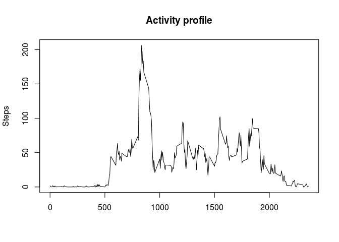

# Reproducible Research: Peer Assessment 1


## 1. Loading and preprocessing the data

The dataset is activity monitoring data. The variables included in this dataset
are:

- steps: Number of steps taking in a 5-minute interval (missing values are coded
  as NA)
- date: The date on which the measurement was taken in YYYY-MM-DD format
- interval: Identifier for the 5-minute interval in which measurement was taken


```r
data_file <- "activity.csv"
if (!file.exists(data_file)) {
    unzip("activity.zip")
}
activity_data <- read.csv(data_file)
str(activity_data)
```

```
## 'data.frame':	17568 obs. of  3 variables:
##  $ steps   : int  NA NA NA NA NA NA NA NA NA NA ...
##  $ date    : Factor w/ 61 levels "2012-10-01","2012-10-02",..: 1 1 1 1 1 1 1 1 1 1 ...
##  $ interval: int  0 5 10 15 20 25 30 35 40 45 ...
```


## 2. What is mean total number of steps taken per day?

Histogram of the total number of steps taken each day:


```r
library(dplyr, warn.conflicts = FALSE)

daily_steps <- activity_data %>%
    group_by(date) %>%
    summarize(steps = sum(steps, na.rm = TRUE))
hist(daily_steps$steps,
     main = "Histogram: Steps per day",
     xlab="Steps per day",
     ylab="Number of days")
```

<!-- -->


```r
mean_steps <- as.integer(round(mean(daily_steps$steps, na.rm = TRUE)))
median_steps <- as.integer(round(median(daily_steps$steps, na.rm = TRUE)))
```

The average per day is 9354 steps and the median per day is
10395 steps.


## 3. What is the average daily activity pattern?

To calculate the activity profile the mean is calculate for all intervals:


```r
activity_profile <- activity_data %>%
    group_by(interval) %>%
    summarize(steps = mean(steps, na.rm = TRUE))

max_row_id <- which.max(activity_profile$steps)
max_interval <- activity_profile[max_row_id,]$interval
max_steps <- format(activity_profile[max_row_id,]$steps, digits=0)
```

The interval when maximum number of steps are taken is 835. This is
the time 8:35 in the morning. The average steps taken then is 206
steps. The daily activity pattern is illustrated by following plot:


```r
plot(activity_profile$interval,
     activity_profile$steps,
     type="l",
     main = "Activity profile",
     xlab="",
     ylab="Steps")
```

<!-- -->


## 4. Imputing missing values


```r
missing <- is.na(activity_data$steps)
missing_observations <- sum(missing)
```

There are 2304 observations missing in the activity dataset.
The strategy to fill in the missing values is to use the mean value for the
interval defined by activity profile. The mean values are rounded to complete
steps.


```r
imputed_data <- activity_data
for( i in 1:length(imputed_data$steps) ) {
    # There must be a better way to do this in R.
    # For loop is not an efficient solution.
    if (is.na(imputed_data[i,]$steps)) {
        interval_id <- imputed_data[i,]$interval
        profile_row <- filter(activity_profile, interval == interval_id)
        imputed_data[i,]$steps = as.integer(round(profile_row$steps))
    }
}
str(imputed_data)
```

```
## 'data.frame':	17568 obs. of  3 variables:
##  $ steps   : int  2 0 0 0 0 2 1 1 0 1 ...
##  $ date    : Factor w/ 61 levels "2012-10-01","2012-10-02",..: 1 1 1 1 1 1 1 1 1 1 ...
##  $ interval: int  0 5 10 15 20 25 30 35 40 45 ...
```

The histogram for imputed dataset:


```r
daily_steps2 <- imputed_data %>%
    group_by(date) %>%
    summarize(steps = sum(steps))
hist(daily_steps2$steps,
     main = "Histogram: Steps per day (imputed)",
     xlab="Steps per day",
     ylab="Number of days")
```

<!-- -->


```r
mean_steps2 <- as.integer(round(mean(daily_steps2$steps)))
median_steps2 <- as.integer(round(median(daily_steps2$steps)))
```

When the dataset has been imputed the average per day is 10766 steps
and the median per day is 10762 steps.

When imputing the dataset it will get a gaussian distribution and the mean and
the median are close to each other.


## 5. Are there differences in activity patterns between weekdays and weekends?


```r
weekend <- c("Sunday", "Saturday")
imputed_data <- imputed_data %>%
    mutate(daytype = ifelse(weekdays(strptime(date, "%Y-%m-%d")) %in% weekend,
                            "weekend", "weekday"))
str(imputed_data)
```

```
## 'data.frame':	17568 obs. of  4 variables:
##  $ steps   : int  2 0 0 0 0 2 1 1 0 1 ...
##  $ date    : Factor w/ 61 levels "2012-10-01","2012-10-02",..: 1 1 1 1 1 1 1 1 1 1 ...
##  $ interval: int  0 5 10 15 20 25 30 35 40 45 ...
##  $ daytype : chr  "weekday" "weekday" "weekday" "weekday" ...
```

```r
week_profile <- imputed_data %>%
    group_by(interval, daytype) %>%
    summarize(steps = mean(steps))
```

The following figure illustrates the differences between weekday and weekend
profiles:


```r
library(ggplot2, warn.conflicts = FALSE)

qplot(interval, steps, data = week_profile) +
    geom_line() +
    facet_wrap(~daytype, nrow = 2)
```

<!-- -->
